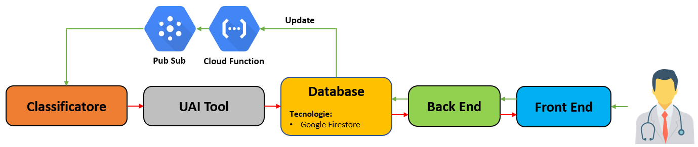

# **Tecniche di Active Learning e Human in the Loop applicate alla classificazione di tracciati cardiologici per l'individuazione di tachicardie**

Repository progetto di tirocinio curricolare e tesi, corso di **Laurea Magistrale in Informatica** presso **l'Università degli studi di Salerno**.

- Studente: **Giuseppe Arienzo**.
- Matricola: **0522501062**.
- Tutor Accademico: **Prof. Rita Francese.**
- Tutor Aziendale: **Luca Montemagno.**
- [**Link registro ore tirocinio**](https://emeal-my.sharepoint.com/:x:/g/personal/giuseppe_arienzo_emea_nttdata_com/EVRY6z_gWM1NimMdLUbXxCcBlTU73DBx03AhY8C6daPDEg?e=xVs0vF)

---

## **Sommario**

- [**Tecniche di Active Learning e Human in the Loop applicate alla classificazione di tracciati cardiologici per l'individuazione di tachicardie**](#tecniche-di-active-learning-e-human-in-the-loop-applicate-alla-classificazione-di-tracciati-cardiologici-per-lindividuazione-di-tachicardie)
  - [**Sommario**](#sommario)
  - [**Definizione del progetto di tesi**](#definizione-del-progetto-di-tesi)
    - [**Obbiettivo**](#obbiettivo)
    - [**Tecnologie utilizzate**](#tecnologie-utilizzate)
    - [**Stato dell'arte**](#stato-dellarte)
  - [**Sviluppo**](#sviluppo)
    - [**Struttura Progettuale**](#struttura-progettuale)
    - [**Stato dello sviluppo**](#stato-dello-sviluppo)

## **Definizione del progetto di tesi**

### **Obbiettivo**

L'obbiettivo del progetto di tesi è quello di applicare tecniche di **Active Learning** e **Human in the Loop** alla classificazione di tracciati cardiologici con lo scopo di individuare tachicardie.

Più nel dettaglio il progetto si pone l'obbiettivo di fornire una piattaforma a cui, personale specializzato, possa accedere per convalidare la classificazione effettuata ed eventualmente sottoporre una correzione che verrà poi sfruttata per il miglioramento del modello di classificazione (**Active Learning**).

### **Tecnologie utilizzate**

Il progetto di tesi vede coinvolte le seguenti tecnologie:

- Per la realizzazione della piattaforma:
  - **Spring**
    - **Spring Security**
  - **React**
    - **MUI**
    - **React Redux**
  - **Google Cloud**
    - **Google Firestore**
  
- Per la messa in opera del servizio:
  - **Google Kubernetes Engine**
  - **Docker**

-  Per la parte di **Active Learning**:

### **Stato dell'arte**

* [**A Survey of Human-in-the-loop for Machine Learning**](https://arxiv.org/abs/2108.00941)
* [**A Survey on Active Learning and Human-in-the-Loop Deep Learning for Medical Image Analysis**](https://arxiv.org/abs/1910.02923)

---

## **Sviluppo**

### **Struttura Progettuale**

Di seguito è riportata una prima bozza di quella che sarà la struttura del progetto:

### **Stato dello sviluppo**

---

- [ ] **Realizzazione del portale**
  - [ ] **Frontend**
    - [ ] Realizzazione di una prima bozza
  - [ ] **Backend**

---

- [ ] **Active Learning**
  - [ ] Studio dello stato dell'arte

---

- [ ] **Messa in opera del servizio**
