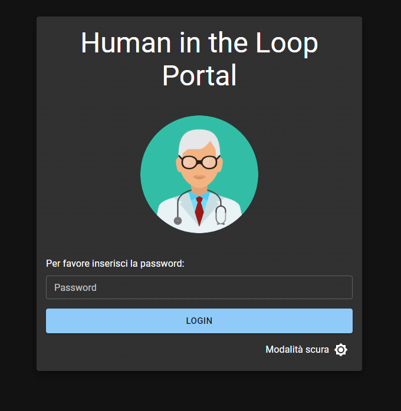
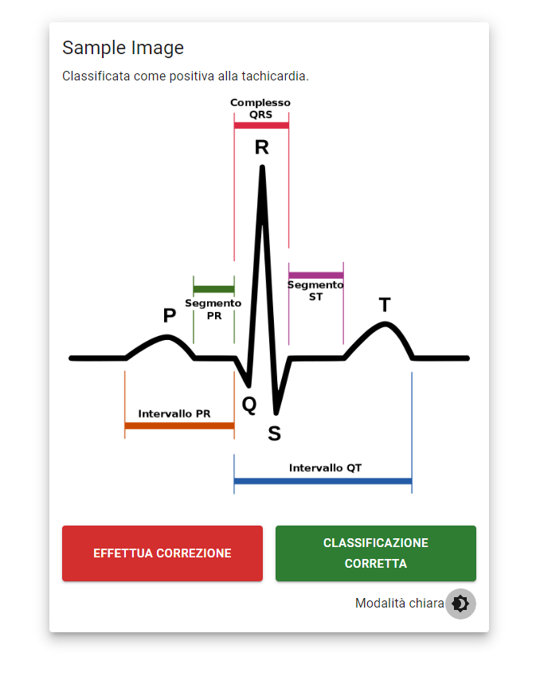
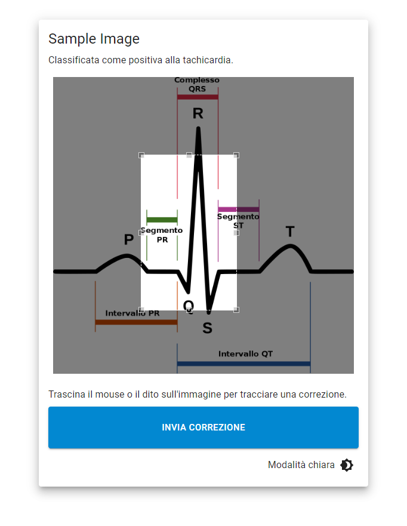

# **Demo portale human in the loop, per tesi di ricerca**

Repository demo per progetto di tesi, corso di **Laurea Magistrale in Informatica** presso **l'Università degli studi di Salerno**.

- Studente: **Giuseppe Arienzo**.
- Matricola: **0522501062**.
- Tutor Accademico: **Prof. Rita Francese.**

---

## **Sommario**

- [**Demo portale human in the loop, per tesi di ricerca**](#demo-portale-human-in-the-loop-per-tesi-di-ricerca)
  - [**Sommario**](#sommario)
  - [**Screenshot**](#screenshot)
    - [Pagina di login:](#pagina-di-login)
    - [Pagina di correzione della classificazione:](#pagina-di-correzione-della-classificazione)
      - [Pagina di inserimento della correzione:](#pagina-di-inserimento-della-correzione)

## **Screenshot**

### Pagina di login:

### Pagina di correzione della classificazione:

#### Pagina di inserimento della correzione:
